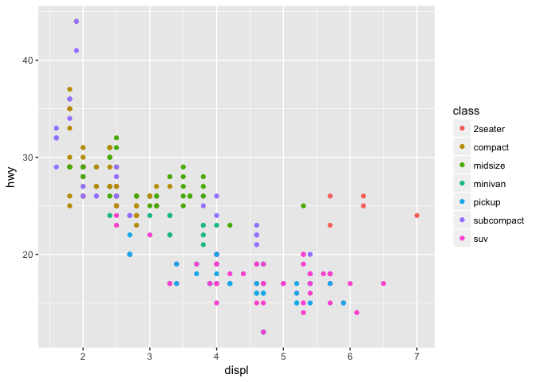

STAT 540 - Seminar 2b: Graphing using ggplot2
================
Fariha Khan
2018-01-10

``` r
library(tidyverse)
```

    ## ── Attaching packages ────────────────────────────────── tidyverse 1.2.1 ──

    ## ✔ ggplot2 2.2.1     ✔ purrr   0.2.4
    ## ✔ tibble  1.4.1     ✔ dplyr   0.7.4
    ## ✔ tidyr   0.7.2     ✔ stringr 1.2.0
    ## ✔ readr   1.1.1     ✔ forcats 0.2.0

    ## ── Conflicts ───────────────────────────────────── tidyverse_conflicts() ──
    ## ✖ dplyr::filter() masks stats::filter()
    ## ✖ dplyr::lag()    masks stats::lag()

The mpg data frame
------------------

``` r
mpg
```

    ## # A tibble: 234 x 11
    ##    manufac… model   displ  year   cyl trans  drv     cty   hwy fl    class
    ##    <chr>    <chr>   <dbl> <int> <int> <chr>  <chr> <int> <int> <chr> <chr>
    ##  1 audi     a4       1.80  1999     4 auto(… f        18    29 p     comp…
    ##  2 audi     a4       1.80  1999     4 manua… f        21    29 p     comp…
    ##  3 audi     a4       2.00  2008     4 manua… f        20    31 p     comp…
    ##  4 audi     a4       2.00  2008     4 auto(… f        21    30 p     comp…
    ##  5 audi     a4       2.80  1999     6 auto(… f        16    26 p     comp…
    ##  6 audi     a4       2.80  1999     6 manua… f        18    26 p     comp…
    ##  7 audi     a4       3.10  2008     6 auto(… f        18    27 p     comp…
    ##  8 audi     a4 qua…  1.80  1999     4 manua… 4        18    26 p     comp…
    ##  9 audi     a4 qua…  1.80  1999     4 auto(… 4        16    25 p     comp…
    ## 10 audi     a4 qua…  2.00  2008     4 manua… 4        20    28 p     comp…
    ## # ... with 224 more rows

Creating a ggplot
-----------------

You can also embed plots, for example:


``` r
ggplot(data = mpg) + 
  geom_point(mapping = aes(x = displ, y = hwy, color = class))
```



``` r
ggplot(data = mpg) + 
      geom_point(mapping = aes(x = displ, y = hwy, size = class))
```

    ## Warning: Using size for a discrete variable is not advised.


Part 2: The layered grammar
---------------------------

``` r
apropos("^geom_")
```

    ##  [1] "geom_abline"     "geom_area"       "geom_bar"       
    ##  [4] "geom_bin2d"      "geom_blank"      "geom_boxplot"   
    ##  [7] "geom_col"        "geom_contour"    "geom_count"     
    ## [10] "geom_crossbar"   "geom_curve"      "geom_density"   
    ## [13] "geom_density_2d" "geom_density2d"  "geom_dotplot"   
    ## [16] "geom_errorbar"   "geom_errorbarh"  "geom_freqpoly"  
    ## [19] "geom_hex"        "geom_histogram"  "geom_hline"     
    ## [22] "geom_jitter"     "geom_label"      "geom_line"      
    ## [25] "geom_linerange"  "geom_map"        "geom_path"      
    ## [28] "geom_point"      "geom_pointrange" "geom_polygon"   
    ## [31] "geom_qq"         "geom_quantile"   "geom_raster"    
    ## [34] "geom_rect"       "geom_ribbon"     "geom_rug"       
    ## [37] "geom_segment"    "geom_smooth"     "geom_spoke"     
    ## [40] "geom_step"       "geom_text"       "geom_tile"      
    ## [43] "geom_violin"     "geom_vline"

``` r
apropos("^stat_")
```

    ##  [1] "stat_bin"         "stat_bin_2d"      "stat_bin_hex"    
    ##  [4] "stat_bin2d"       "stat_binhex"      "stat_boxplot"    
    ##  [7] "stat_contour"     "stat_count"       "stat_density"    
    ## [10] "stat_density_2d"  "stat_density2d"   "stat_ecdf"       
    ## [13] "stat_ellipse"     "stat_function"    "stat_identity"   
    ## [16] "stat_qq"          "stat_quantile"    "stat_smooth"     
    ## [19] "stat_spoke"       "stat_sum"         "stat_summary"    
    ## [22] "stat_summary_2d"  "stat_summary_bin" "stat_summary_hex"
    ## [25] "stat_summary2d"   "stat_unique"      "stat_ydensity"

``` r
apropos("^scale_")
```

    ##  [1] "scale_alpha"               "scale_alpha_continuous"   
    ##  [3] "scale_alpha_discrete"      "scale_alpha_identity"     
    ##  [5] "scale_alpha_manual"        "scale_color_brewer"       
    ##  [7] "scale_color_continuous"    "scale_color_discrete"     
    ##  [9] "scale_color_distiller"     "scale_color_gradient"     
    ## [11] "scale_color_gradient2"     "scale_color_gradientn"    
    ## [13] "scale_color_grey"          "scale_color_hue"          
    ## [15] "scale_color_identity"      "scale_color_manual"       
    ## [17] "scale_colour_brewer"       "scale_colour_continuous"  
    ## [19] "scale_colour_date"         "scale_colour_datetime"    
    ## [21] "scale_colour_discrete"     "scale_colour_distiller"   
    ## [23] "scale_colour_gradient"     "scale_colour_gradient2"   
    ## [25] "scale_colour_gradientn"    "scale_colour_grey"        
    ## [27] "scale_colour_hue"          "scale_colour_identity"    
    ## [29] "scale_colour_manual"       "scale_fill_brewer"        
    ## [31] "scale_fill_continuous"     "scale_fill_date"          
    ## [33] "scale_fill_datetime"       "scale_fill_discrete"      
    ## [35] "scale_fill_distiller"      "scale_fill_gradient"      
    ## [37] "scale_fill_gradient2"      "scale_fill_gradientn"     
    ## [39] "scale_fill_grey"           "scale_fill_hue"           
    ## [41] "scale_fill_identity"       "scale_fill_manual"        
    ## [43] "scale_linetype"            "scale_linetype_continuous"
    ## [45] "scale_linetype_discrete"   "scale_linetype_identity"  
    ## [47] "scale_linetype_manual"     "scale_radius"             
    ## [49] "scale_shape"               "scale_shape_continuous"   
    ## [51] "scale_shape_discrete"      "scale_shape_identity"     
    ## [53] "scale_shape_manual"        "scale_size"               
    ## [55] "scale_size_area"           "scale_size_continuous"    
    ## [57] "scale_size_date"           "scale_size_datetime"      
    ## [59] "scale_size_discrete"       "scale_size_identity"      
    ## [61] "scale_size_manual"         "scale_x_continuous"       
    ## [63] "scale_x_date"              "scale_x_datetime"         
    ## [65] "scale_x_discrete"          "scale_x_log10"            
    ## [67] "scale_x_reverse"           "scale_x_sqrt"             
    ## [69] "scale_x_time"              "scale_y_continuous"       
    ## [71] "scale_y_date"              "scale_y_datetime"         
    ## [73] "scale_y_discrete"          "scale_y_log10"            
    ## [75] "scale_y_reverse"           "scale_y_sqrt"             
    ## [77] "scale_y_time"

``` r
ggplot(data = mpg, 
       mapping = aes(x = displ, y = hwy)) +
  geom_point() +
  geom_smooth()
```

    ## `geom_smooth()` using method = 'loess'


Part 3: Deliverable
-------------------

``` r
ggplot(data = mpg, 
       mapping = aes(x = displ, y = hwy)) +
  geom_point(aes(size = class, color = drv)) 
```

    ## Warning: Using size for a discrete variable is not advised.


